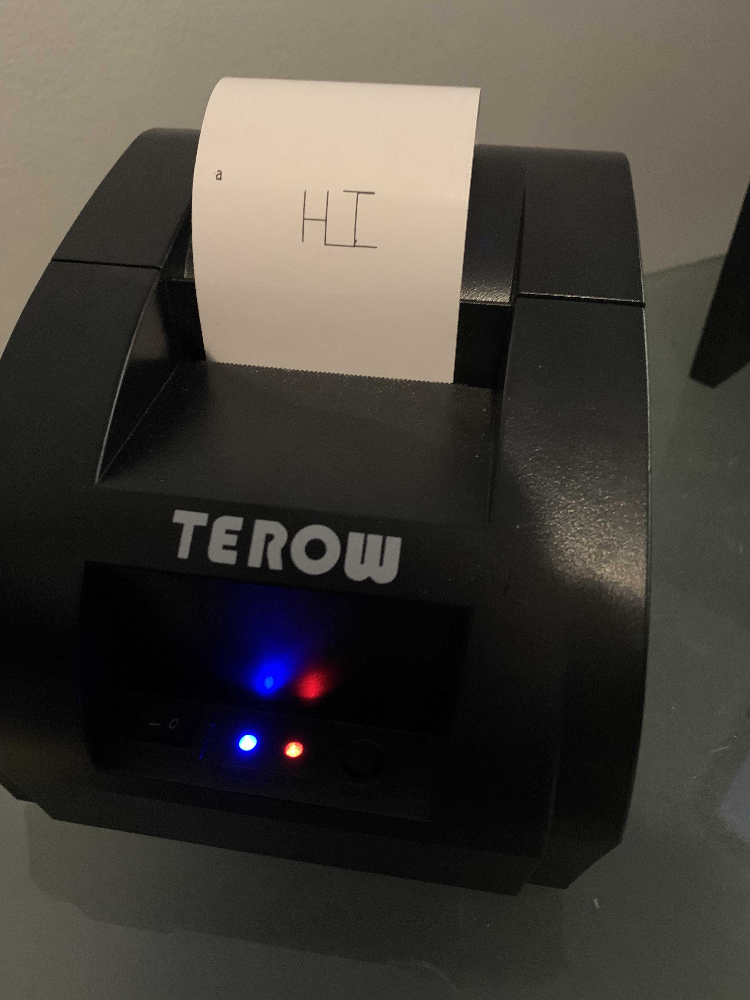

# web-usb-etch-a-sketch
A HTML5 canvas Etch a sketch with support for printing to a thermal printer via WebUSB or Node server.

Inspired by a talk at FFConf Brighton by Suz Hinton (@noopkat).

# What?

Simple HTML/JS/CSS etch-a-sketch, able to send the images you draw on the canvas to a node server where they will be printed to a connected receipt printer.

I had some problems getting WebUSB working in Windows (Didn't bring my work laptop home with me) but was able to print from Node, so that's what I'm doing for now.

The WebUSB part will come - but maybe only for MacOS.

# Why?
Why not?

